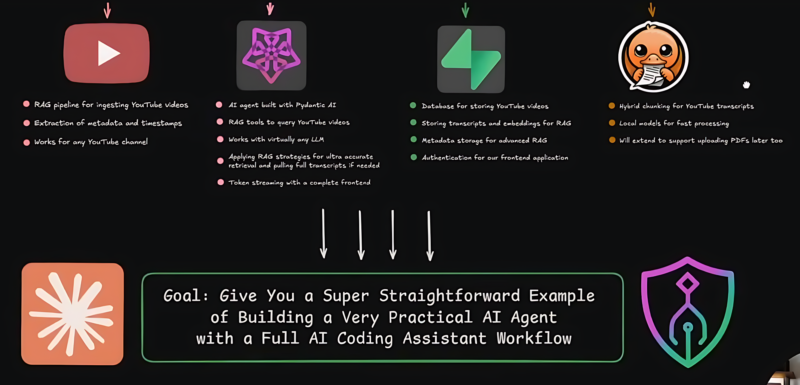

# Week 11: AI Agent Obserability, Optimization, and Security

This week readings are longer and fewer to focus the mind and bring together many of the divese streams of thought we've covered to this point from zshell config to agentic frameworks to AI research to the developing a better model of AI-driven economics and social unrest including China's growing role. Some of these topics are better addressed in class while others are optimized for long-form content like realistic long-form AI enterprise development. 

In-class, we'll tidy-up our from last class and go deeper into the LangChain, LangGraph and LangSmith eco-system reviewing lower level issues like control flow, hooks, traces, and related AI engineering issues. With this under the belt we'll proceed to carefully analyze this week's main assignment: live coding a RAG-based Personal AI Coach.

## ===[ ArXiv.org Research Paper 5 min Presentation ]===

| Date   | Name(s)              |
|--------|----------------------|
| 11/12  | Wisdom, Godwin       |
| 11/19  | Ann-Duncan, Adrian   |
| 12/3   | Murathan, Eli        |

## Quiz: Week 8

## Presentation: Wisdom

## Presentation: Godwin

## Mini-Project #3: A real-world RAG Recommendation

* DUE by Nov 7th (This Fri): **ASSIGNED GROUP SECTION**
    - This is also a COLLABORATIVE TEAM PROJECT, part of your grade is based upon completing your group's subtask assigned in last class. 
    - Please update your groups tasks report to our [Mini-Project #3 Github](https://github.com/jon-chun/iphs391-mp3-agentic-rag-system-report) where the instructions have been updated, cleaned, and moved from our week 11 course webpage.
    - Submit your group task report in markdown (*.md), plain text (*.txt), and/or PDF (from best to worst for AI ingestion/reuse)
    -  Submissions past this date will be marked down. Your fellow classmates are relying upon you to complete this on time in order to complete their own personal CAPB Report this weekend
* DUE by Nov 12th (next class): **INDIVIDUAL CAP REPORT**
    Your INDIVIDUAL final [CAPB Report](../code/tech-reports/student_report_skeleton.md) following this [CAPB Scoring Rubric](../code/tech-reports/overview_and_rubric.md)

## ===[ New Reading Assignments ]===

### **[ Humanistic Readings ]**

* [How AI WIPES Out Capitalism Emad Mostaque (21:12) (Oct 2025)](https://www.youtube.com/watch?v=vfhszRuMA8Y&t=739s)

### **[AI News/Current Events]**

* [Build on OpenAI at your own risk! (5:50) (3 Nov 2025)](https://www.youtube.com/watch?v=3Qzv4KdtJuc)
* [The Chinese AI Iceberg (27:06) (2 Nov 2025)](https://www.youtube.com/watch?v=XFhUI1fphKU&t=1396s)

### **[ New Technical Assignments ]**

### Misc

* [(Wiki) Markdown](https://en.wikipedia.org/wiki/Markdown)
* [(Wiki) POSIX](https://en.wikipedia.org/wiki/POSIX)

### Z-Shell: .zprofile, .zshrc, and XDG_Base

* [zsh - my config, and how to set up yours! (9:47) (Mar 2025)](https://www.youtube.com/watch?v=kCmgJSUrKuo)
* [How I Setup My Mac Terminal To Make It Amazing (18:03) (Oct 2025)](https://www.youtube.com/watch?v=oR_B2gQDVf4&t=486s)

### LangChain DeepAgents

* [(CLI Agents with Memory) Introducing DeepAgents CLI by Trivedy (30 Oct 2025)](https://blog.langchain.com/introducing-deepagents-cli/)
* [(LangChain) Deep Agent CLI: Coding Assistant with Memory (7:15) (31 Oct 2025)](https://www.youtube.com/watch?v=IrnacLa9PJc)
  - [(Github) LangChain DeepAgents (5k)](https://github.com/langchain-ai/deepagents)

## ===[ Coding ]===

### Realistic AI Project Development

* (ONLY FIRST HOUR)[First LIVE Agent Build - Fullstack RAG Agent for YouTube Content (3:05:05) (26 Oct 2025)](https://www.youtube.com/watch?v=ZHcXavLTA5s)
  - [Github](https://github.com/coleam00/dynamous-ai-coach)
  - STT
    - [AquaVoice](https://aquavoice.com/)
    - [(FOSS) https://epicenter.so/whispering/](epicenter.so/whispering)
  - [Excalidraw]()
  - [Obsidian]()
  - [(Scrape YT Transcripts) Supadata](https://supadata.ai/)

 

### LangChain & LangGraph

* [LangChain Academy: Deep Agents with LangGraph](https://academy.langchain.com/courses/deep-agents-with-langgraph)