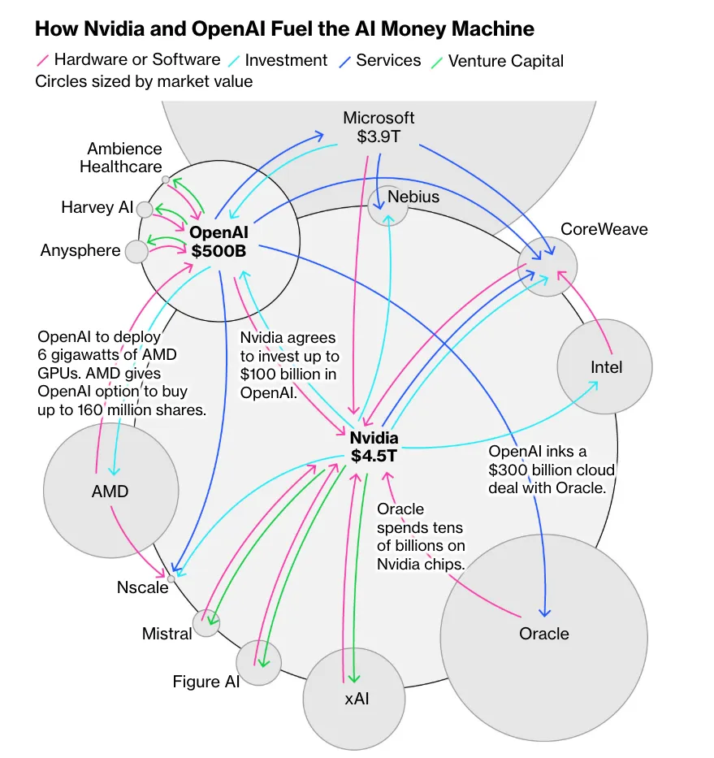

# Week 12: AI Subagents, GitHub Workflows and Benchmarks

This week we'll integrate both old and new views into Agents through the LangChain, LangGraph, and LangSmith framework abstractions. In additiona, we'll continue our dive into GitHub and see how it is evolving to become the center of AI-assisted software engineering. Finally, we'll close the loop and continue our analysis of various topics from AI-assisted coding to software development lifecycle to spec-driven development by integrating these concepts into a unified intellectual framework. 

## ===[ ArXiv.org Research Paper 5 min Presentation ]===

| Date   | Name(s)              |
|--------|----------------------|
| 11/19  | Anne-Duncan, Adrian  |
| 12/3   | Murathan, Eli        |

## Quiz: Week 12

## Presentation: Anne-Duncan

## Mini-Project #3: A real-world RAG Recommendation

* DUE by Sun, Nov 16th (midnight EST)
  - Create a GitHub repo with your uploaded doc and profesional README.md overview

## ===[ New Reading Assignments ]===

## **[ Humanistic Readings ]**

* [The AI Tech Layoff Lie Nobody's Thinks Of (16:19) (Oct 2025)](https://www.youtube.com/watch?v=COSAtGWh85Y&t=252s)

## **[AI News/Current Events]**

* [As AI Tools Become Commonplace, so Do Concerns by NCSL Staff (11 Nov 2025)](https://www.ncsl.org/state-legislatures-news/details/as-ai-tools-become-commonplace-so-do-concerns)

## **[ New Technical Assignments ]**

### AI Models

### Claude Code

* [How to create custom Skills](https://support.claude.com/en/articles/12512198-how-to-create-custom-skills)
* [800+ hours of Learning Claude Code in 8 minutes (2026 tutorial / unknown tricks / newest model) (8:00) (Oct 2025)](https://www.youtube.com/watch?v=Ffh9OeJ7yxw)
* [Master Claude Code Sub‑Agents in 10 Minutes (10:03) (Aug 2025)](https://www.youtube.com/watch?v=mEt-i8FunG8)

### GitHub Work Flows

* [Claude Code + GitHub WORKFLOW for Complex Apps (18:40) (Jul 2025)](https://www.youtube.com/watch?v=FjHtZnjNEBU&t=182s)
  - [Github Actions: Continuous integration](https://docs.github.com/en/actions/get-started/continuous-integration)
* [Github Flow](https://docs.github.com/en/get-started/using-github/github-flow)
* [GitHub is the Future of AI Coding (Here's Why) (23:59) (13 Nov 2025)](https://www.youtube.com/watch?v=upwbqZ67UBA)

## ===[ Coding ]===

### LangChain & LangGraph

* [LangChain Academy: Deep Research with LangGraph](https://academy.langchain.com/courses/deep-research-with-langgraph)

# =====[ In Class ]=====

## CLI Utilities (usually Rust)

* Programmer Utilities (Brew)
  - [asitop (4.4k)](https://github.com/tlkh/asitop)
  - [bat (55.8k)](https://github.com/sharkdp/bat) (UNIX cat++)
  - [broot (12.1k)](https://dystroy.org/broot/)
  - [eza (18.4k)](https://github.com/eza-community/eza)
    "CLI> eza -T -l --hyperlink"
  - [fd (40.5k)](https://github.com/sharkdp/fd)
  - [font-jetbrains-mono-nerd-font (60.5k)](https://github.com/ryanoasis/nerd-fonts)
  - [fx](https://fx.wtf/)
  - fzf (75.1k)](https://github.com/junegunn/fzf)
  - [gh](https://cli.github.com/)
  - **git-lfs** "brew install git-lfs"
  - [Gitnuro (2.1)](https://github.com/JetpackDuba/Gitnuro)
  - [git-delta (28.1k)](https://github.com/dandavison/delta)
  - [ghostty (38.2k)](https://github.com/ghostty-org/ghostty)
  - [jq]()
  - [llm-min (664)](https://github.com/marv1nnnnn/llm-min.txt)
    SKF: Structured Knowledge Format
  - [macmon]()
  - **ncdu** "brew install ncdu"
  - [neovim]()
  - [ripgrep (57.4k)](https://github.com/BurntSushi/ripgrep)
  - [tig (13k)](https://github.com/jonas/tig?tab=readme-ov-file)
  - [tlrc (60.1k)](https://github.com/tldr-pages/tldr)
  - [tmux](https://github.com/tmux/tmux/wiki)
  - [tokei (13.4k)](https://github.com/XAMPPRocky/tokei)
    [tokei-pie]
    "create uv venv, source, and uv pip install tokei-pie"
    "CLI> cd ~/code/test-tokei-pie; source .venv/bin/activate"
    "CLI> tokei -o json ~/code/sentimentarcs | tokei-pie"
  - [tree]()
  - [wget]()
  - [zoxide (31.2k)](https://github.com/ajeetdsouza/zoxide)

## Cost Tracking/Optimization

* [The Hidden Cost of Claude Code: Cost Optimization and Token Usage Monitoring (7:46) (26 Sep 2025)](https://www.youtube.com/watch?v=HCko-NxCD_8)
  - [https://console.anthropic.com/](https://console.anthropic.com/)
  - [(Github) Claude Code Usage Monitor (5.7k)](https://github.com/Maciek-roboblog/Claude-Code-Usage-Monitor)
  - [ccusage](https://github.com/ryoppippi/ccusage)
-   "CLI> npx ccusage blocks --live"
  - [claude-squad](https://github.com/smtg-ai/claude-squad)
    "CLI> brew install claude-squad"

## Context Engineering: Formats

| Alternative | Description | Context from Comments |
| :--- | :--- | :--- |
| **JSON** | The widely accepted standard object notation. | It is the **mainstream** format LLMs are tuned for, and many compression goals can be achieved within JSON by using array expressions instead of full objects for repetitive data. |
| **YAML** | A human-readable data serialization format, often considered more compact than full JSON. | It is suggested as an existing alternative, though a commenter notes that for repetitive objects, it still requires keys on each object, unlike TOON's CSV-like structure. The current YAML spec is [YAML 1.2](https://yaml.org/spec/1.2.2/). |
| **Plain Text / Templating** | Using well-structured, custom plaintext formats with clear headers. | Some argue that "good ol' **templating**" gives the most flexibility, as LLMs are tuned to natural language, and different structures may work better as JSON, YAML, or an arbitrary custom format. |
| **XML** | Extensible Markup Language. | Mentioned as a format that some models appear to handle better than JSON, possibly due to the names in the element tags. |
| **TOML** | Tom's Obvious, Minimal Language. | Suggested as an alternative that has "some readability and compactness benefits over JSON while still being common enough for models to easily be able to process it relatively reliably." |
| **CUE** | A data constraint language and configuration tool. | Mentioned as a tool that can **emit other formats** and includes strong features like modules and imports for configuration languages: [https://cuelang.org](https://cuelang.org) and [https://cuetorials.com](https://cuetorials.com). |
| **SICK** | A binary deduplicating storage for JSON-like data structures. | Offered as a highly efficient, non-manually editable alternative focused on space and access speed: [https://github.com/7mind/sick](https://github.com/7mind/sick). |
  
## Context Engineering: Tranformation Libraries

* [llm-min.txt (664)](https://github.com/marv1nnnnn/llm-min.txt)
    Min.js Style Compression of Tech Docs for LLM Context
* [https://github.com/QuantaAlpha/RepoMaster (437)](https://github.com/QuantaAlpha/RepoMaster)
    RepoMaster: The open-source AI agent that masters GitHub. It turns any code repository into a powerful tool, achieving a new level of autonomous task-solving. An open alternative to Claude-Code.
* (DEMO: Format Research/Eval)[toon-format/toon (18.1k)](https://github.com/toon-format/toon)
  - [(YT) TOON: “JSON for AI” (is it any good?) (14:20) (18 Nov 2025)](https://www.youtube.com/watch?v=nTMP_rLZOYM)
  - [(YNes) TOON – Token Oriented Object Notation (28 Oct 2025)](https://news.ycombinator.com/item?id=45715632)
      PROMPT: "summarize, esp the pros/cons and alternative solutions including URL/names/links"
* [7mind/sick (161)](https://github.com/7mind/sick)
  
## Context Engineering: History

* (DEMO: History)[https://github.com/jhlee0409/claude-code-history-viewer (200)](https://github.com/jhlee0409/claude-code-history-viewer)
    git clone https://github.com/jhlee0409/claude-code-history-viewer.git
    cd claude-code-history-viewer
    # Run the setup script to install all dependencies
    ./scripts/setup-build-env.sh
    # Build the application (auto-detects your platform)
    pnpm tauri:build:auto

## Context Engineering Distillation

* (DEMO: Distill)[SpecStory](https://docs.specstory.com/integrations/vscode)
  - [Install SpecStory for Claude CLI](https://docs.specstory.com/integrations/claude-code)
  - "CLI> "
  - VSCode Extension "

* (DEMO: Session Metrics)[chiphuyen/sniffly (1k)](https://github.com/chiphuyen/sniffly)
  - "CLI> uvx sniffly@latest init"

## Learn Git

* [The Git Book v2](https://git-scm.com/book/en/v2)

**top 10 most commonly used Git commands** 

1. **git status**  
   Checks the current state of your working directory and staging area.  
   - `git status` (basic short output)  
   - `git status -s` (short format, compact view)  
   - `git status --porcelain` (machine-readable output, often for scripts)

2. **git add**  
   Stages changes for the next commit.  
   - `git add <file>` (stage a specific file)  
   - `git add .` (stage all changes in current directory)  
   - `git add -A` or `git add --all` (stage all changes, including new/untracked files)  
   - `git add -p` (interactive staging, choose hunks)

3. **git commit**  
   Records staged changes to the repository.  
   - `git commit -m "message"` (commit with inline message)  
   - `git commit -a -m "message"` (skip staging for tracked files)  
   - `git commit --amend` (modify the last commit)  
   - `git commit -m "title" -m "description"` (multi-line message)

4. **git clone**  
   Creates a local copy of a remote repository.  
   - `git clone <url>` (basic clone)  
   - `git clone <url> <directory>` (clone into specific folder)  
   - `git clone --depth 1 <url>` (shallow clone, only latest history)  
   - `git clone -b <branch> <url>` (clone specific branch)

5. **git pull**  
   Fetches from remote and merges into current branch.  
   - `git pull` (default: fast-forward or merge)  
   - `git pull --rebase` (rebase instead of merge)  
   - `git pull origin <branch>` (specify remote and branch)  
   - `git pull --ff-only` (fast-forward only, fail otherwise)

6. **git push**  
   Uploads local commits to a remote repository.  
   - `git push` (push current branch to its tracked remote)  
   - `git push origin <branch>` (specify remote and branch)  
   - `git push -u origin <branch>` (set upstream tracking)  
   - `git push --force-with-lease` (safe force push)

7. **git branch**  
   Lists, creates, or deletes branches.  
   - `git branch` (list local branches)  
   - `git branch -a` (list all branches, including remote)  
   - `git branch <name>` (create new branch)  
   - `git branch -d <name>` (delete merged branch) / `-D` (force delete)

8. **git checkout**  
   Switches branches or restores files (note: largely replaced by `git switch`/`git restore` in modern Git).  
   - `git checkout <branch>` (switch branch)  
   - `git checkout -b <new-branch>` (create and switch)  
   - `git checkout <commit> -- <file>` (restore file from commit)  
   - `git checkout main` (common to return to main)

9. **git log**  
   Shows commit history.  
   - `git log` (full history)  
   - `git log --oneline` (one line per commit)  
   - `git log --graph --oneline --all` (visual branch graph)  
   - `git log -p` (show diffs for each commit)

10. **git merge**  
    Merges branches together.  
    - `git merge <branch>` (merge specified branch into current)  
    - `git merge --no-ff <branch>` (force a merge commit)  
    - `git merge --abort` (cancel a conflicted merge)  
    - `git merge --squash <branch>` (squash changes before committing)

These commands cover ~90% of everyday Git usage for most developers. For newer Git versions (2.23+), `git switch` (for branch switching) and `git restore` (for file restoration) are increasingly popular replacements for some `checkout` uses, and you might see them rising in future lists. If you spend a lot of time in terminals, aliases (e.g., `gs` for `git status`) make these even faster!

## Git Apps

* VSCode 3 Extensions "Git Extension Pack"
* Commercial: GitKraken, GitLens, etc.
* [(App) Gitnuro Download](https://gitnuro.com/)
  - [(Github) Gitnuro (2.1k)](https://github.com/JetpackDuba/Gitnuro)
* [(App) SourceGit (3.3k)](https://github.com/sourcegit-scm/sourcegit)
* [(App) RelaGit (889)](https://github.com/relagit/relagit)
* [(CLI) edamagit (1.5k)](https://github.com/kahole/edamagit)

## Github Workflows

* (DEMO)[GitHub is the Future of AI Coding (Here's Why) (23:59) (13 Nov 2025)](https://www.youtube.com/watch?v=upwbqZ67UBA)
* [Git Marketplace Action/AI-Assisted](https://github.com/marketplace?type=actions&category=ai-assisted)
* [Claude Code + GitHub WORKFLOW for Complex Apps (18:40) (Jul 2025)](https://www.youtube.com/watch?v=FjHtZnjNEBU&t=182s)
  - [Github Actions: Continuous integration](https://docs.github.com/en/actions/get-started/continuous-integration)
    **SLDC w/CC+Github**
    * PLAN:
      1. Use 'gh issue view' to get the issue details
      2. Understand the problem described in the issue
      3. Ask clarifying questions if necessary
      4. Understand the prior art for this issue
      - Search the scratchpads for previous thoughts related to the issue
      - Search PRs to see if you can find history on this issue
      - Search the codebase for relevant files
      1. Think harder about how to break the issue down into a series of small,
      manageable tasks.
      2. Document your plan in a new scratchpad
      - include the issue name in the filename
      - include a link to the issue in the scratchpad.  
    * CREATE:
      - Create a new branch for the issue
      - Solve the issue in small, manageable steps, according to your plan.
      - Commit your changes after each step.
    * TEST:
      - Use puppeteer via MCP to test the changes if you have made changes to the UI
      - Write rspec tests to describe the expected behavior of your code
      - Run the full test suite to ensure you haven't broken anything
      - If the tests are failing, fix them
      - Ensure that all tests are passing before moving on to the next step
    * DEPLOY:
      - Open a PR and request a code review
* [Claude Code + Codex: The GitHub Flow That Saves Me Hours (18:42) (18 Oct 2025)](https://www.youtube.com/watch?v=bcXxke-iBQY)
* [MERGE TO MAIN](https://www.ceos3c.com/web-development/github-ai-workflow/)
- Instructions, append to CC> init > CLAUDE.md file
# "Merge to Main" Workflow
When the user says "merge to main", follow this complete workflow:
## Pre-Merge Preparation
1. **Pull latest main** - Fetch and merge the latest changes from remote main
2. **Validate branch naming** - Create a conventional commits conform branch using kebab-case:
   - `feat/feature-name` for new features
   - `fix/bug-name` for bug fixes
   - `docs/update-name` for documentation
   - `refactor/change-name` for code refactoring
   - `test/test-name` for test additions
   - `chore/task-name` for maintenance tasks
## Commit and Push
1. **Run pre-commit checks** - Execute tests and linters if applicable; report any failures
2. **Commit changes** - Use detailed conventional commits messages:
   - Format: `type(scope): description`
   - Examples: `feat(auth): add user authentication`, `fix(dashboard): resolve memory leak`
   - Include body with details if changes are complex
3. **Check for conflicts** - Ensure branch can merge cleanly with main
4. **Push branch** - Push the branch to remote
## Pull Request Creation
1. **Create Pull Request** - Generate PR to main with:
   - Descriptive title matching commit message format
   - Body containing: changes summary, testing done, breaking changes (if any)
   - Link related issues if applicable
## Confirmation and Merge
1. **Wait for CI/CD** - Allow automated checks to complete; report status
2. **Present summary** - Show user:
   - All commits to be merged
   - Files changed
   - CI/CD status
   - Any warnings or conflicts
3.  **Request confirmation** - Ask: "Ready to merge to main? (yes/no)"
4.  **Merge PR** - After confirmation, merge using squash or merge commit (ask user preference)
5.  **Verify merge** - Confirm merge was successful
## Cleanup
1.  **Delete remote branch** - Remove the feature branch from remote
2.  **Update local main** - Pull the updated main branch locally
3.  **Confirm completion** - Report successful merge with commit SHA
## Error Handling
- **If tests fail**: Report failures and ask whether to fix or abort
- **If merge conflicts exist**: Report conflicts and ask user to resolve manually
- **If PR creation fails**: Report error and suggest manual creation
- **If CI/CD fails**: Report failures and ask whether to fix or abort

